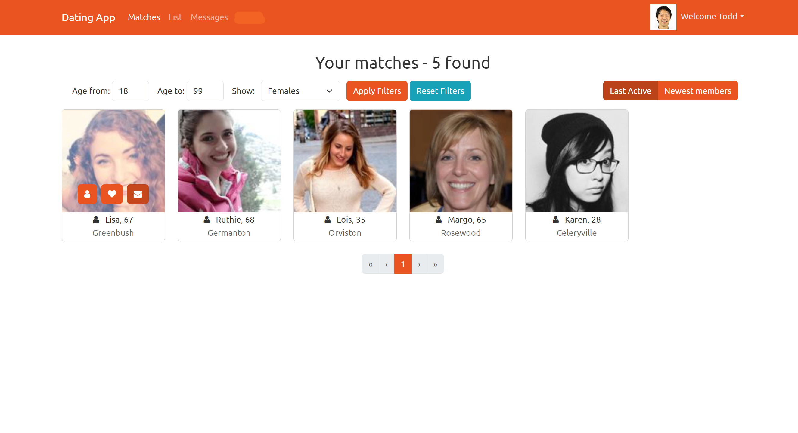

# Dating App: Build an app with ASPNET Core and Angular from scratch udemy course

- Learn how to build a web application from start to publishing using ASPNET Core, Entity Framework Core and Angular
- Learn how to integrate 3rd party components into the Angular application
- Using Automapper in ASP.NET Core
- Adding routing to the Angular application and securing routes.
- Implement drag and drop photo upload integrating into a cloud platform
- Implement a private messaging system
- Implement filtering, sorting and paging of data
- Display notifications in Angular
- Implement Authentication using JWT Authentication tokens
- Angular Template forms and Reactive forms and validation
- Handling errors in the API and the SPA
- Persist data using Entity Framework Core
- Using SignalR for real time presence and live messaging between users
- Dockerising application
